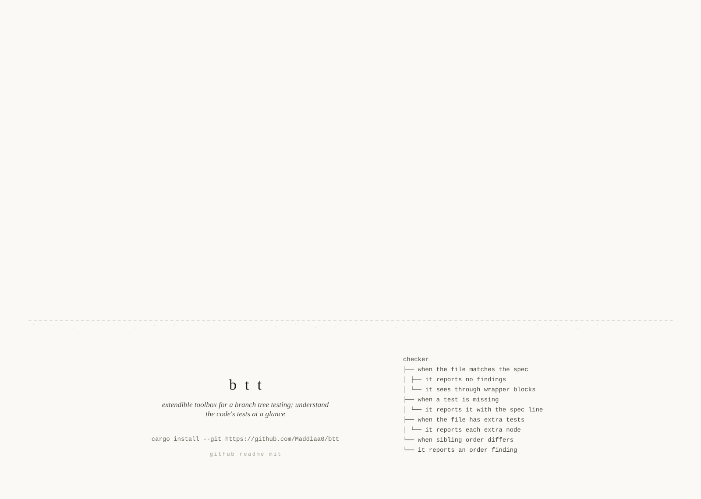

<p align="center">
  
</p>

# btt — branch tree testing, for any language

A generalization of [bulloak](https://bulloak.dev). Test suites are specified
as `.tree` files (given/when/it branching trees); `btt` scaffolds test
skeletons from them and checks that test files stay in sync — for any
language, via data-only **packs**.

```text
HashMap
├── when the key is present
│   ├── it returns the value
│   └── when the value was overwritten
│       └── it returns the latest value
└── when the key is absent
    └── it returns none
```

```console
$ btt scaffold map.tree          # generate the test skeleton
$ btt check                      # verify every .tree matches its test file
✓ src/tree.tree (tree.rs)
✗ src/map.tree → map.rs
    error missing test  `when_the_key_is_absent > returns_none` (map.tree:7)
```

A glance at the `.tree` files tells you the whole behavior surface of a test
suite without reading test code — and gives coding agents a spec to write
tests against.

## Install

```sh
cargo install --path .   # installs to ~/.cargo/bin/btt
```

Then in each project you want checked: `btt init` writes a starter
`btt.toml`; add `--skill` to also install the agent skill described below.

## Agents

btt is built for the loop where an agent writes the tests: the `.tree` file
is the spec, the agent scaffolds and fills it in, and `btt check` keeps it
honest. Two copy-paste files in this repo — they are **not** interchangeable:

- **[AGENT-SETUP.md](AGENT-SETUP.md)** — a one-time prompt. Paste it into a
  *chat* with your coding agent and it installs btt and initializes your
  project for you. It does not belong in any config file.
- **[SNIPPET.md](SNIPPET.md)** — permanent instructions. Paste it into your
  `CLAUDE.md` / `AGENTS.md` so agents work tree-first. Claude Code users can
  skip it: `btt init --skill` installs a richer skill at
  `.claude/skills/btt/SKILL.md` instead.

## Architecture

One small static binary; languages are **packs** — declarative data, plus
optionally a sandboxed grammar module:

```text
packs/rust/
  pack.toml            # detection globs, naming rules, grammar ref
  queries/tests.scm    # tree-sitter query marking blocks and tests
  templates/test.jinja # scaffold template
```

The core does everything language-agnostic: parse `.tree` specs, run the
pack's tree-sitter query over the test file, derive nesting structurally
(a node's parent is the smallest captured block containing it), apply the
pack's naming rules, and diff. Three mapping strategies cover essentially all
test conventions:

- **nested blocks + flat test names** — Rust `mod`s + `#[test]` fns
- **nested blocks + verbatim titles** — vitest/jest/bun `describe`/`it`
- **flat joined names** — bulloak-style Solidity, Go, pytest (planned)

### Pack resolution (the nvm-ish part)

```text
<repo>/.btt/packs/<name>/            # project-local / vendored — highest priority
$XDG_CONFIG_HOME/btt/packs/<name>/   # user-global (default ~/.config/btt/packs)
~/.btt/packs/<name>/                 # user-global, legacy location
(embedded in the binary)             # rust, typescript
```

Adding a language never means rebuilding the binary: drop a pack folder in
`.btt/packs/` and name it in `packs = [...]`. Activation is explicit —
with no configured list only the builtins load, so a pack sitting in a
directory (a cloned repo's `.btt/packs/`, a stale user dir) is never
executed just for being visible. Named packs resolve in the order above,
which makes vendoring an override of a builtin a feature you asked for,
not a surprise. The trust boundary is explicit:

- **Pack data** (manifest, query, naming rules, templates) is declarative —
  reviewable like any config change. Manifests are parsed strictly and
  every path they name is confined to the pack directory.
- **Grammar wasm** (optional, `wasm` feature) is the one part of a pack
  that is code. It runs sandboxed (see below), but treat it like a
  dependency: review it, pin digests, get it from a source you trust.

### Sandboxed WASM grammars (experimental)

With the `wasm` feature (`cargo install btt --features wasm`), a pack can
ship its own grammar instead of relying on a builtin:

```toml
[grammar]
source = "wasm:grammar.wasm"   # a `tree-sitter build --wasm` artifact
symbol = "rust"                # module exports tree_sitter_<symbol>
```

This is the same architecture Zed uses: the tree-sitter runtime stays
native, while the grammar module — including any external scanner code, the
only arbitrary code a grammar ships — is instantiated in a wasmtime store
with no WASI, so it has no ambient filesystem or network access. The
`packs-wasm/` directory holds wasm twins of the builtin packs (grammars
fetched by `scripts/fetch-wasm-grammars.sh`, pinned by release tag and
sha256), and `tests/wasm.rs` proves they extract structure identical to the
natively compiled grammars. Without the feature, the core stays lean and
wasm packs fail with a clear error.

**What the sandbox is and isn't.** No-WASI instantiation removes ambient
authority — a grammar cannot open files or sockets. It is *not* a hardened
boundary against deliberately hostile modules: tree-sitter's host bridge is
native code that consumes module-provided tables, and there is currently no
fuel/epoch limit on grammar execution. Wasm grammars are therefore
**trusted, provenance-pinned artifacts** — vet them like dependencies, as
the fetch script's tag + sha256 pinning models. Running genuinely untrusted
packs would need a resource-limited subprocess; that is future work, not a
property of today's implementation.

### Lexical packs (prototype)

A pack can skip grammars entirely: `source = "lexical"` replaces the
query and grammar with a small declarative profile — comment and string
syntax, nesting brackets, and two regexes describing what a block and a
test look like:

```toml
[grammar]
source = "lexical"

[lexical]
line_comment = "//"
block_comment = ["/*", "*/"]
strings = [{ delim = '"', escape = '\' }, { delim = "'", escape = '\' }]
nest = [["(", ")"], ["{", "}"]]

[lexical.block]
open = '...regex with a (?<name>...) capture...'

[lexical.test]
open = '...'
```

The core masks comments and strings, matches openers only in real code
(comment trivia between tokens behaves as whitespace), and derives
nesting from bracket spans — the same structural containment rule the
grammar path uses. Two shapes are covered: call-pattern tests
(`it("title", ...)`, `name_syntax = "js-string"`) and
declaration-pattern tests (`function test_x(`, `mod when_y {`,
`name_syntax = "raw"`), which is enough for BDD frameworks and
prefix-named test conventions (Foundry, Go, pytest-style).

Be clear-eyed about the tradeoff: **a lexical pack will not be perfect.**
It is deliberately not a parser — syntax the profile cannot see (JS regex
literals and template interpolation, Python's indentation nesting, Ruby's
`do … end`) is out of scope, by design. (Attribute markers like `#[test]`
*are* covered: the rust profile encodes them in its opener regex.)
That is the price of the extension story: the whole language definition
is reviewable text that fits on one screen, installs by dropping a
folder, and needs no compiled artifact to vet, pin, or distribute. What
makes the imperfection safe rather than silent is that the scanner
**fails closed** — malformed profiles fail at pack load, and files it
cannot fully account for (unbalanced brackets, unterminated strings or
comments) are tool errors, never partial extractions. When a language
outgrows the profile, the answer is a grammar pack (`wasm:`), not a
cleverer regex. Two profile twins ship in-repo — `packs-lexical/typescript`
and `packs-lexical/rust` (whose `#[test]` marker lives in the opener
regex) — and both are differentially fuzzed against their native grammars
in `tests/lexical.rs` to keep the extraction paths identical on realistic
test files. Checking btt's own specs with the rust profile passes 10 of
12 files; the two that embed TypeScript sources in raw strings
(`r#"…"#`, unmodeled) fail closed with a line number.

## Configuration

`btt.toml` at the repo root:

```toml
[project]
packs = ["rust"]        # routing-priority order; empty/absent = builtins only

[check]
extra = "warn"          # tests in the file but not the tree: error|warn|ignore
order = "warn"          # sibling order drift: error|warn|ignore
uncovered = "warn"      # test-bearing files with no .tree spec: error|warn|ignore
```

Missing tests are always errors. `btt check` exits non-zero on errors — wire
it into CI or a pre-commit hook.

`uncovered` is what makes partial adoption honest: `check` reports not just
"the covered files match" but "these files have tests and no spec at all"
(it reverse-matches each pack's target patterns and extracts, so a repo with
zero `.tree` files reports every test file instead of a hollow pass). Keep
it at `warn` while adopting; in CI, ratchet everything to strict:

```toml
[check]
extra = "error"
order = "error"
uncovered = "error"
```

## Commands

| command | |
|---|---|
| `btt check [paths] [-j N]` | diff every `.tree` against its test file (parallel; `-j` caps threads) |
| `btt scaffold <tree>` | generate a skeleton (`--stdout`, `--force`, `--pack`) |
| `btt packs` | list packs and where they resolve from |
| `btt init [--skill]` | write `btt.toml` (+ Claude skill for agents) |

Scaffold output is location-aware where a language has more than one
test-file shape: for Rust, a target under `tests/` (an integration
crate, already all test code) scaffolds flat, while anywhere else the
skeleton is wrapped in `#[cfg(test)] mod tests { … }`. Both shapes check
identically — the pack declares `tests` as a structurally transparent
wrapper.

## Benchmarks

`cargo bench` runs the check pipeline over 40 generated tree/test pairs at
1/4/8 threads (`benches/check.rs`); add `--features wasm` for the
sandboxed-grammar groups (fetch grammars first). Criterion keeps baselines
under `target/criterion` — `cargo bench -- --save-baseline main` before a
change, `-- --baseline main` after, to see the delta.

Read the two group kinds together: the steady-state groups (`check/...`)
show warm wasm parsing indistinguishable from native, but they exclude
grammar compilation; the `-cold` groups build a fresh thread pool per
iteration and expose the per-thread Cranelift compile wasm pays (~50 ms
per grammar per thread with a warm engine). A fully cold *process* also
pays one-time wasmtime engine setup — roughly half a second end-to-end in
release CLI measurements. Neither number alone is the whole story.

## Dogfood

This repo checks itself: every module's tests follow `.tree` specs
(`src/*.tree`, `tests/*.tree`), and `tests/selfcheck.rs` runs the full
check pipeline as part of `cargo test`.
